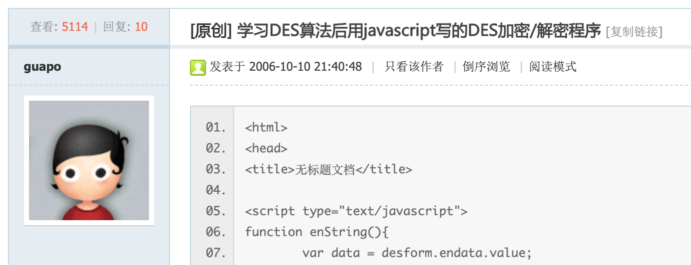

# DES-Encrypt-Guapo-for-Python

Guapo版本DES加密的Python实现

---

## 1. DES(Guapo)介绍

该版本的DES算法是由id为guapo的用户于2006年学习DES算法时实现的，目前网络上存在JavaScript和Java版本的实现，但是Python版本的实现尚无，故本人将其实现并进行了一些修改（基于Python特性精简了冗余代码），使其更加易于使用。

- [2006年guapo发布于51js论坛](http://bbs.51js.com/thread-62293-1-1.html)

## 2. `js2py` -> `Python` 的效率提升

由于之前网络上尚无该算法的Python版本，调用该算法只能通过js2py等解析方法曲线救国，此法使用方便，但运行guapo的1000余行JavaScript则效率极低：

    

而将其转换为Python版本后，效率提升了近100倍：

    

